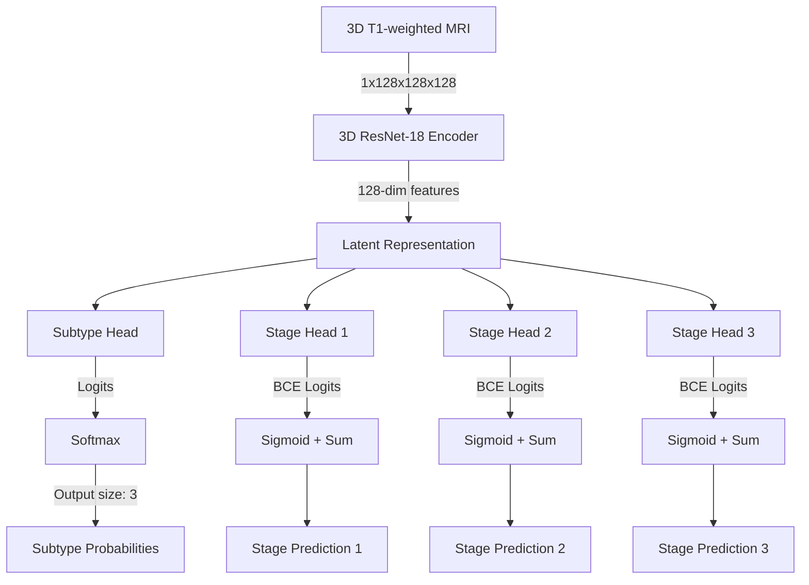

# SuStaIn 3D CNN Progression Predictor

A PyTorch implementation of a multi-head 3D ResNet-18 CNN model designed to predict disease **subtypes** and **stages** directly from structural T1-weighted MRI scans. 

This model integrates Subtype and Stage Inference (SuStaIn) outputs into a deep learning pipeline, matching the architectural style of the HOPE (Hybrid-granularity Ordinal Prototype Learning) framework.

---

## 1. Model Architecture Flow

The model maps a single-channel 3D MRI volume `(1, 128, 128, 128)` to classification and progression targets:



### Shared Encoder
*   **Backbone**: 3D ResNet-18 convolutional network with a global average pooling block and a feature projector, producing a **128-dimensional latent vector** per subject.

### Task-Specific Heads
1.  **Subtype Prediction Head**: A two-layer MLP mapping `128 -> 64 -> 3`. It outputs raw logits for the 3 distinct disease subtypes.
2.  **Subtype-Specific Stage Prediction Heads**: 3 independent MLPs (one for each subtype) mapping `128 -> 64 -> 48`. Each head outputs a 48-dimensional logit vector representing the cumulative sequence of 48 progression events.

---

## 2. Multi-Task Training & Loss Formulation

### Subtype Classification Loss
We use **Soft Cross-Entropy Loss** to preserve the classification uncertainty computed by SuStaIn:
\[
\mathcal{L}_{\text{subtype}} = - \frac{1}{N} \sum_{i=1}^N \sum_{c=1}^3 P(c \mid \text{subject } i) \log \hat{P}(c \mid \text{subject } i)
\]
where \(P(c \mid i)\) are the ground-truth probabilities from the CSV (`Prob_Subtype_1`, `Prob_Subtype_2`, `Prob_Subtype_3`) and \(\hat{P}(c \mid i)\) is the softmax prediction of the subtype head.

### Stage Progression Loss (Pure Hard Masking)
Stages in SuStaIn are defined strictly relative to a subtype's progression sequence. Because the input CSV only provides the `Assigned_Stage` for the `Assigned_Subtype` \(c^*\), we isolate the training of the stage heads:
1.  Represent the stage \(S \in [0, 48]\) as a binary cumulative vector \(\mathbf{y} \in \{0, 1\}^{48}\) where \(y_j = 1\) if \(j \le S\) else \(0\).
2.  Compute Binary Cross-Entropy (BCE) loss **only** on the assigned subtype head \(c^*\):
    \[
    \mathcal{L}_{\text{stage}} = \mathcal{L}_{\text{stage\_c^*}} = \text{BCE}(\sigma(\mathbf{v}_{c^*}), \mathbf{y})
    \]
    where \(\sigma\) is the Sigmoid activation and \(\mathbf{v}_{c^*}\) is the logit vector from stage head \(c^*\).
3.  The other two stage heads are masked out, preventing unrelated trajectories from interfering with each other.

---

## 3. Evaluation Metrics

### Subtype Classification Metrics
*   **Sub Acc (Accuracy)**: Percentage of correct hard subtype predictions (\(\text{argmax}(\text{logits}) + 1\) vs `Assigned_Subtype`).
*   **F1 (Macro-Averaged F1-Score)**: Harmonic mean of precision and recall evaluated per class and averaged. This is the **primary metric** for subtype classification quality because it is robust to class imbalance.
*   **MSE (Probability Mean Squared Error)**: Measures how well the model calibrates its predictions by computing the MSE between predicted softmax probabilities and soft SuStaIn targets.

### Staging Progression Metrics
*   **Stg MAE (Stage Mean Absolute Error)**: 
    \[
    \text{MAE} = \frac{1}{N} \sum_{i=1}^N |\hat{S}_i - S_i|
    \]
    Where the predicted stage \(\hat{S}\) is reconstructed from event occurrence probabilities: \(\hat{S} = \sum_{c=1}^3 \hat{P}(c) \sum_{j=1}^{48} \sigma(v_{c, j})\). It measures, on average, how many event steps the prediction deviates from the SuStaIn staging.
*   **QWK (Quadratic Weighted Kappa)**: Computes the agreement between rounded predicted stages and true stages (0 to 48). Disagreements are penalized quadratically (e.g. an error of 10 stages is penalized 100 times more than an error of 1 stage).
*   **Rho (Spearman Rank Correlation Coefficient)**: Measures the monotonic ordering of predicted stages. A high Rho indicates the model correctly ranks patients from least progressed to most progressed.

---

## 4. How to Run

### Local or Kaggle Script Execution
Use `train_sustain_cnn.py` to run the Stratified 5-Fold Cross-Validation pipeline. 

```bash
python3 train_sustain_cnn.py \
    --data_root /path/to/subject/npz_directory \
    --csv_path /path/to/sustain_subject_staging_results.csv \
    --epochs 60 \
    --kfold 5 \
    --batch_size 4 \
    --experiment_name sustain_resnet18_v1
```

*   **Mock Verification**: Use the `--mock_data` flag to verify the entire data loader, training loops, and metrics calculation locally without downloading the 3D NPZ volumes:
    ```bash
    python3 train_sustain_cnn.py --mock_data --epochs 2 --kfold 5 --experiment_name mock_test
    ```

### Checkpoints & Output CSV
1.  **Checkpoints**: For each fold, the script saves:
    *   `best_model_fold{k}.pth`: Best model on validation loss.
    *   `latest_model_fold{k}.pth`: Saved weights at the final epoch.
2.  **Out-Of-Fold Predictions**: Once cross-validation finishes, the script generates a comparison CSV at `outputs/runs/{experiment_name}/{experiment_name}_predictions.csv` containing test-split predictions for all subjects.
